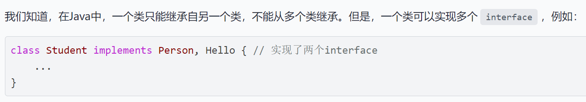
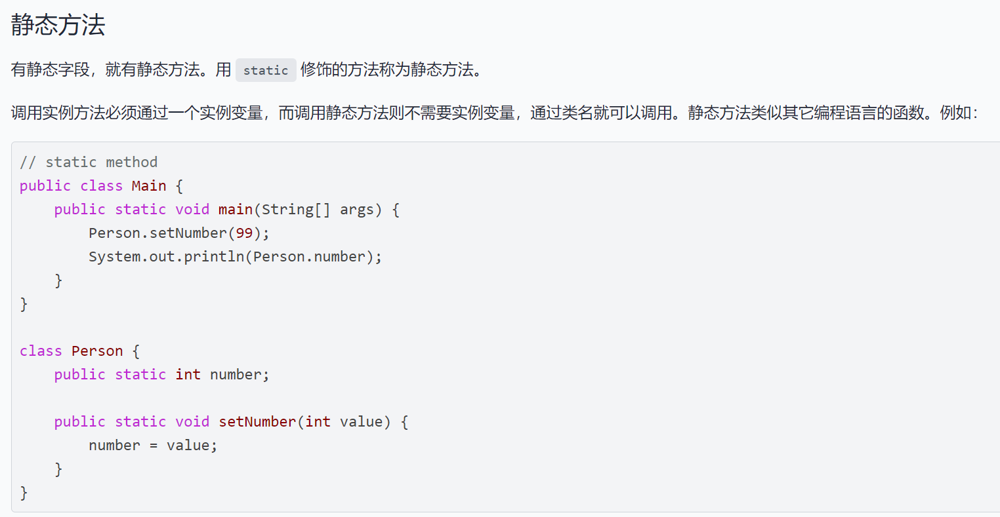
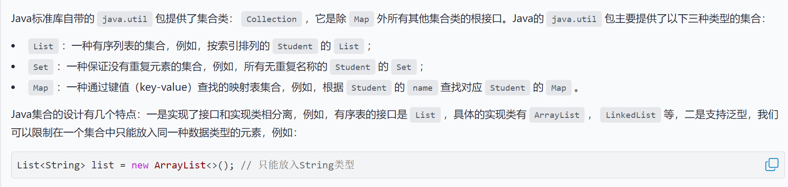
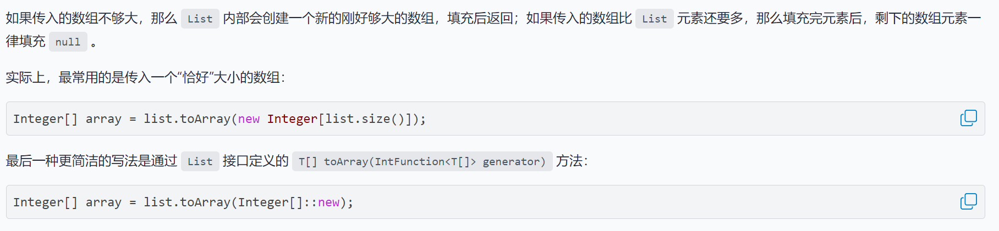
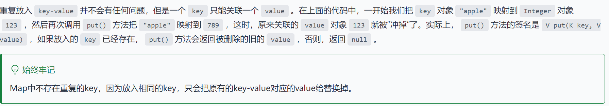
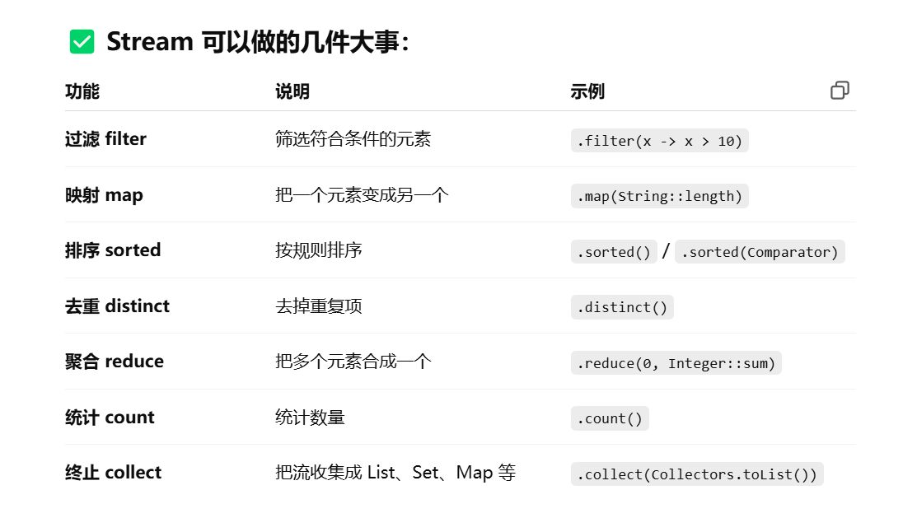
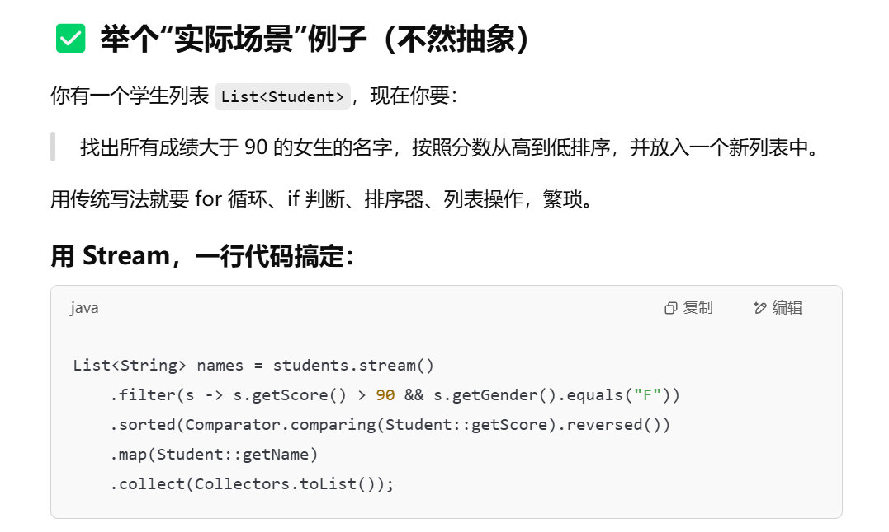

# ==Java==


**抽象类abstract里面可以有字段，而interface中连字段都不能有，只能定义方法和常量(即public static final int AAA=1;这种，可以省略psf，但是必须定义好变量等于xxx)**

(extends	implements)



接口也可以继承接口，

```java
interface Hello{
    void hello();
}
interface Person extends Hello{
    void run();
    String getName();
}
```

接口中，可以定义default方法，实现该接口的类可以不覆写带default的方法。

所有示例共享一个静态字段，使用类名来访问静态字段(而不是实例名)




接口只能拥有"final"修饰的'静态'字段：final static int MALE=1;

Arrays类

java.util.Arrays

int[] a={1,2,3,999,43442};

int[] a=new int[300];

int len=a.length;//get length

for (int age:ages){

	Sout(age);

}

Arrays.sort(a);//数组排序




## 集合类

1. List

- ArrayList

  - List<String> list=new ArrayList<>()

    - list.add("lalala")

    - list.remove(1)/list.remove("lalala")

    - list.add(1,"lalala")	

    - list.set(1,"ohhhhh")(替换index=1的值)

    - list.isEmpty()

    - list.toString()

    - list.indexOf("lalala")

    - list.contains("lalala")

    - ```java
      List<Person> list = List.of(
                  new Person("Xiao", "Ming", 18),
                  new Person("Xiao", "Hong", 25),
                  new Person("Bob", "Smith", 20)
              );
      ```

    - 

- LinkedList

2. Map

- Map<String,Object> map=new HashMap<>()      Object s=new Object("xiaowang",99)
  - map.put("xiaowang",s)//添加映射
  - Object target=map.get("xiaowang")//接收映射的实例
  - 
  - HashMap也可以初始化，...=new HashMap<>()
  - HashMap内部有一个数组，用于存value，通过key计算出索引
  - 通过`key`计算索引的方式就是调用`key`对象的`hashCode()`方法，它返回一个`int`整数。`HashMap`正是通过这个方法直接定位`key`对应的`value`的索引，继而直接返回`value`。
  
  3. TreeMap
  
  - 要是存对象需要覆写Comparable方法
  
  **Comparable和Comparator**
  
  两个方法分别是：int compareTo()和int compare()

# Stream流




