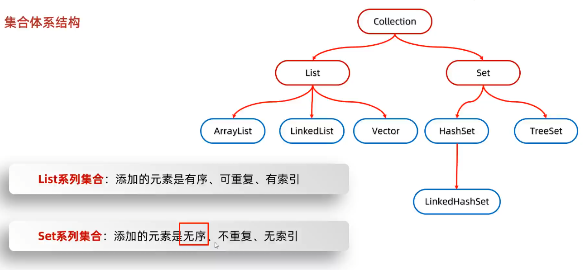
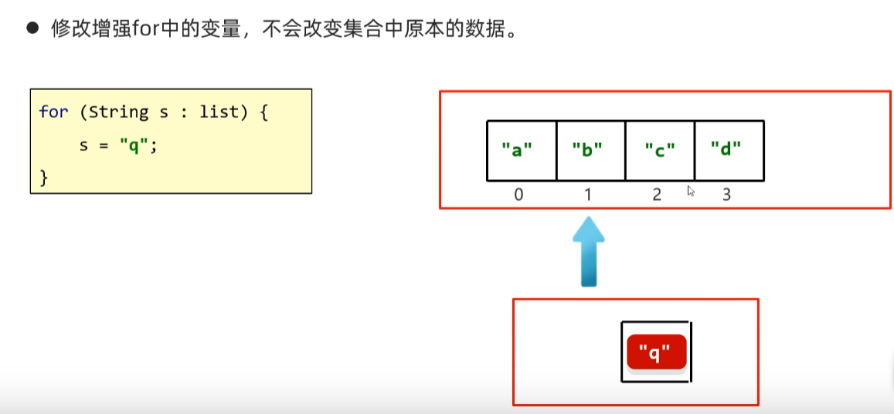
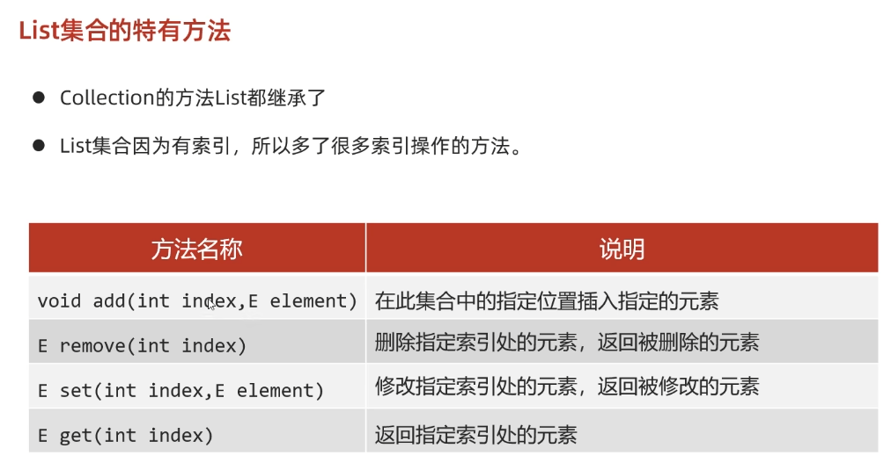
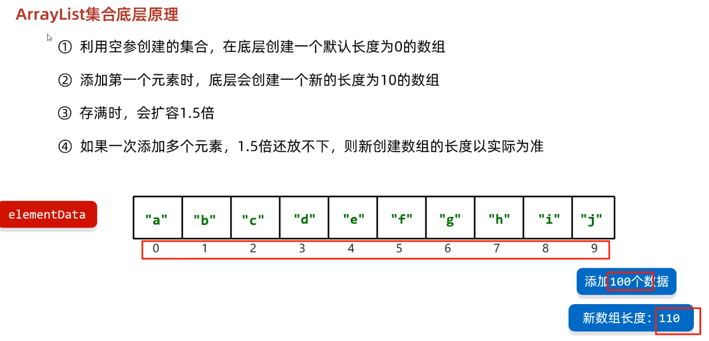
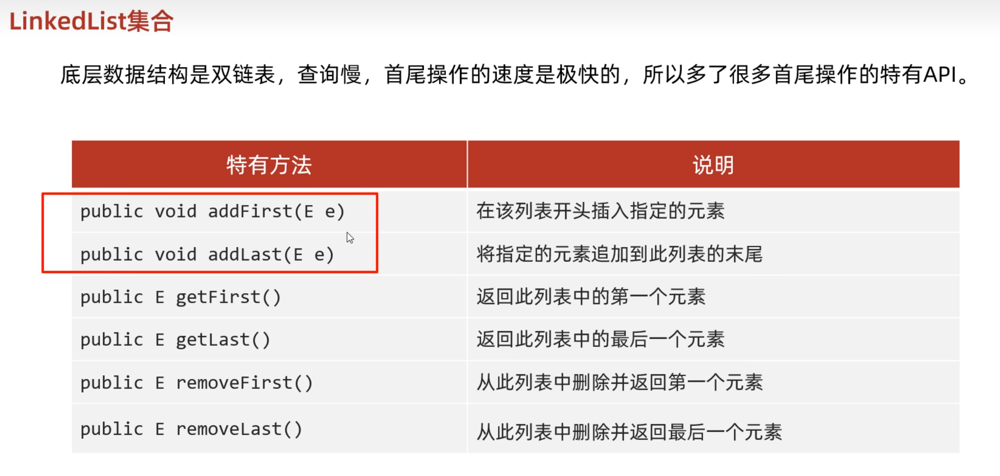
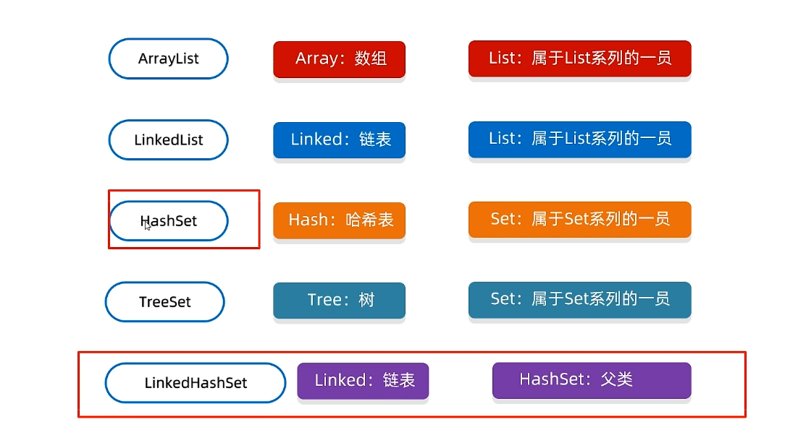

**总共分两种：Collection（单）和Map（双）**

List<String> list = new ArrayList<>();
Set<Integer> set = new HashSet<>();
Map<String, Integer> map = new HashMap<>();

---


// List
for (String s : list) { ... }

// Set
for (Integer x : set) { ... }

// Map
for (Map.Entry<String, Integer> entry : map.entrySet()) {
    String key = entry.getKey();
    Integer val = entry.getValue();
}

> 红的是接口蓝的是实现类



### Map的常用方法

| 方法                          | 说明                                        | 示例                                                         |
| ----------------------------- | ------------------------------------------- | ------------------------------------------------------------ |
| `put(K key, V value)`         | 添加或更新键值对                            | `map.put("apple", 3);`                                       |
| `get(Object key)`             | 获取指定 key 对应的值，若不存在返回 `null`  | `map.get("apple");`                                          |
| `containsKey(Object key)`     | 是否包含某个 key                            | `map.containsKey("apple");`                                  |
| `containsValue(Object value)` | 是否包含某个 value                          | `map.containsValue(3);`                                      |
| `remove(Object key)`          | 移除指定 key 的键值对                       | `map.remove("apple");`                                       |
| `size()`                      | 返回键值对的数量                            | `map.size();`                                                |
| `isEmpty()`                   | 判断 map 是否为空                           | `map.isEmpty();`                                             |
| `clear()`                     | 清空所有元素                                | `map.clear();`                                               |
| `keySet()`                    | 获取所有键的集合（Set）                     | `Set<String> keys = map.keySet();`                           |
| `values()`                    | 获取所有值的集合（Collection）              | `Collection<Integer> values = map.values();`                 |
| `entrySet()`                  | 获取所有键值对的集合（Set<Map.Entry<K,V>>） | `for (Map.Entry<String, Integer> entry : map.entrySet()) {...}` |
| `putIfAbsent(K key, V value)` | 如果 key 不存在才放入 value                 | `map.putIfAbsent("banana", 5);`                              |
| `replace(K key, V value)`     | 替换 key 对应的值（如果 key 存在）          | `map.replace("apple", 10);`                                  |

>  IDEA快捷键：``alt+insert``

```java
//遍历Map的最佳方式
for (Map.Entry<String, Integer> entry : map.entrySet()) {
    System.out.println("key = " + entry.getKey() + ", value = " + entry.getValue());
}
```

- 所有单列集合和数组才能使用增强for进行遍历
- **修改增强for循环的变量时，不改变原本集合中的数据**

eg.

- foreach与lambda表达式结合的写法

```java
List<String> names = Arrays.asList("Alice", "Bob", "Charlie");

// 使用 Lambda 表达式和 forEach 方法
names.forEach(name -> {
    System.out.println(name);
});
```

### LIst







- 泛型里面不能写基本类型，因为不能转化为``Object``类型


