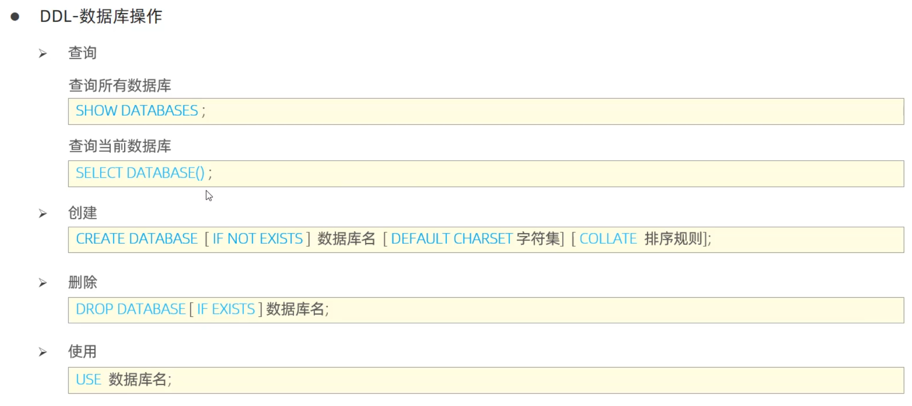
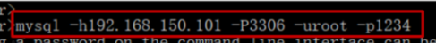

> cmd中输入services.msc

- 总体结构

MySQL Server（服务器）
├── Database1（数据库）
│   ├── Table1（表）
│   │   ├── Row1（行）
│   │   └── Row2（行）
│   └── Table2（表）
├── Database2（数据库）
│   └── Table3（表）
└── ...

RDBMS 是支持关系型表格结构和完整事务管理的 DBMS，是 DBMS 的一种更高级形式。

- DDL （Data Definition Language）— 数据定义语言
- DML （Data Manipulation Language）— 数据操作语言
- DQL （Data Query Language）— 数据查询语言
- DCL  （Data Control Language）— 数据控制语言



- 连接企业数据库服务器的语句

- ```Java
  mysql [-h数据库服务器的IP地址 -P端口号] -u用户名 -p密码
  ```



DQL查询语句

```SQL
SELECT
        字段列表
FROM
        表名列表
WHERE
        条件列表
GROUP  BY
        分组字段列表
HAVING
        分组后条件列表
ORDER BY
        排序字段列表
LIMIT
        分页参数
```
