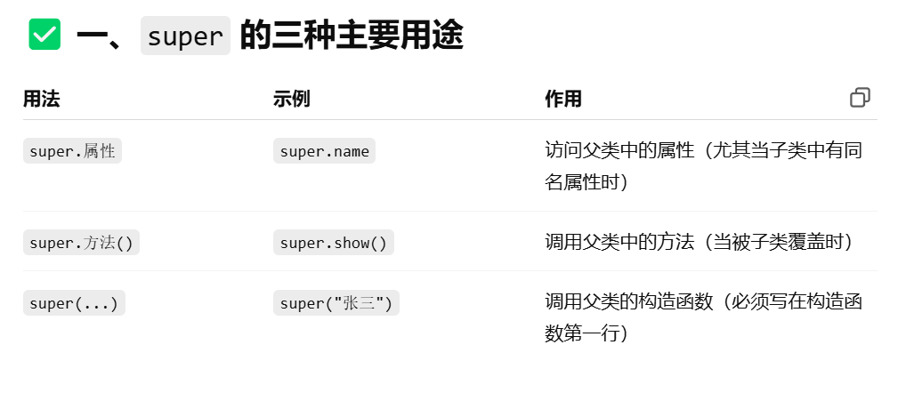

# 内部类


Inner Class的实例**不能单独存在**，必须依附于一个Outer Class的实例。

好处是，可以访问外部类的private字段/方法

```Java
// inner class
public class Main {
    public static void main(String[] args) {
        Outer outer = new Outer("Nested"); // 实例化一个Outer
        Outer.Inner inner = outer.new Inner(); // 实例化一个Inner
        inner.hello();
    }
}

class Outer {
    private String name;

    Outer(String name) {
        this.name = name;
    }

    class Inner {
        void hello() {
            System.out.println("Hello, " + Outer.this.name);
        }
    }
}

```

### Anonymous Class(匿名类)

这是一种特殊的内部类

```Java
// Anonymous Class
public class Main {
    public static void main(String[] args) {
        Outer outer = new Outer("Nested");
        outer.asyncHello();
    }
}

class Outer {
    private String name;

    Outer(String name) {
        this.name = name;
    }

    void asyncHello() {
        Runnable r = new Runnable() {
            @Override
            public void run() {
                System.out.println("Hello, " + Outer.this.name);
            }
        };
        new Thread(r).start();
    }
}

```

