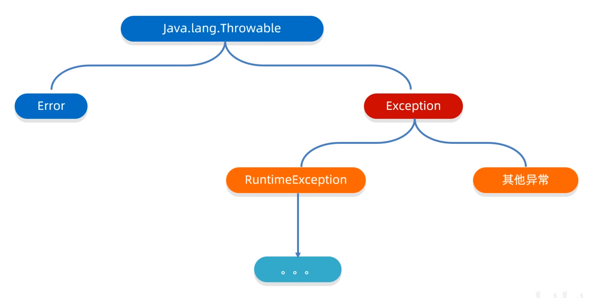
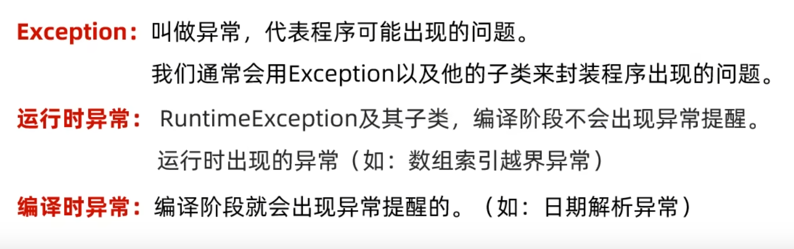
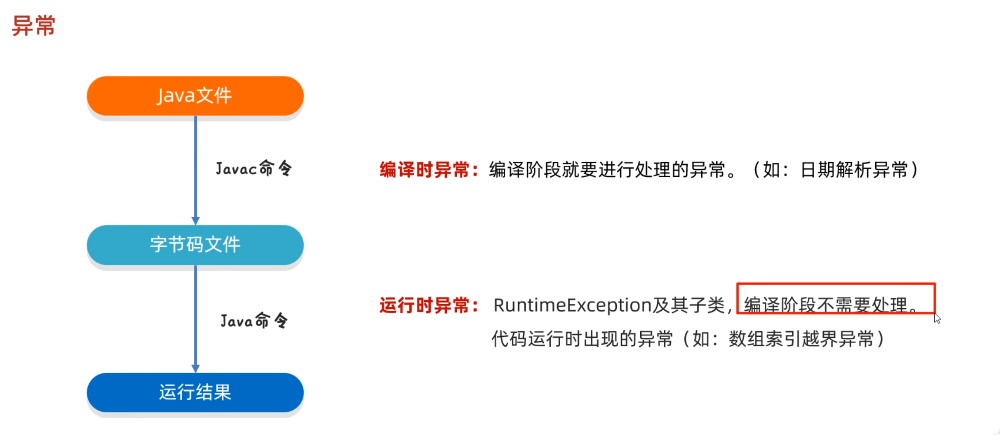
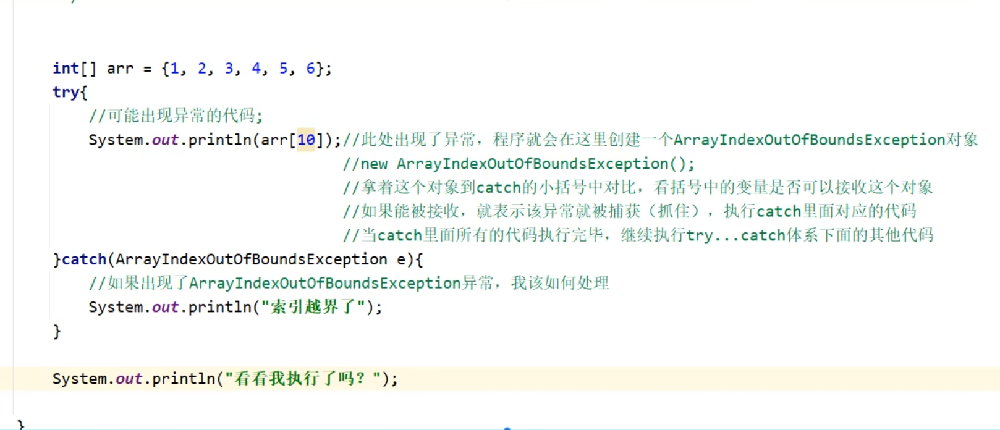
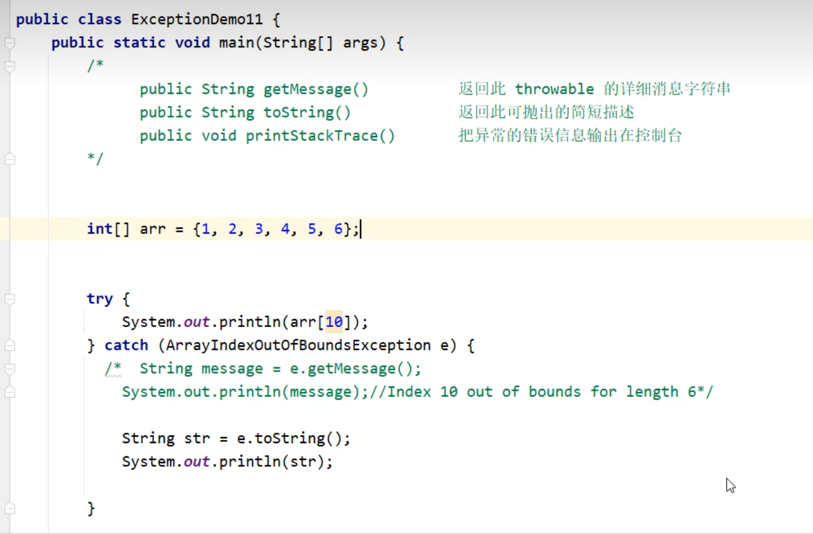

# 异常

**体系如下：**



> Error是系统级别错误，是给sun公司用的，程序员不必理会。





> try-catch捕获异常

``` java
try{
    xxx
}catch(异常类名 变量名){
    
}
```



- 如果有多个异常，就用多个catch，或者在catch括号里用“|”

- 如果出现异常了，try后面的代码也不执行了

> ctrl+alt+t可以用xx语句块包含被选中的代码


