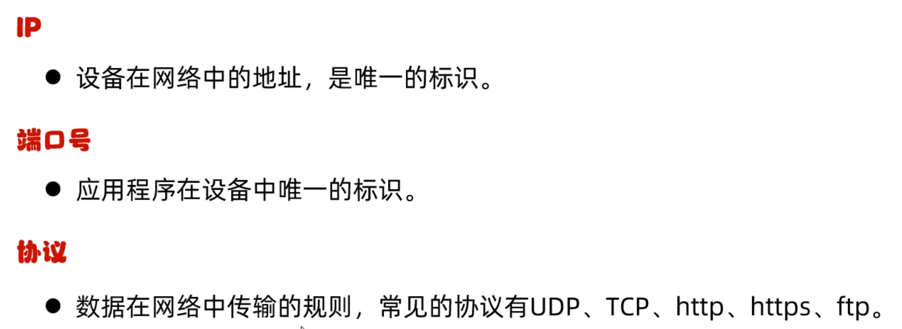
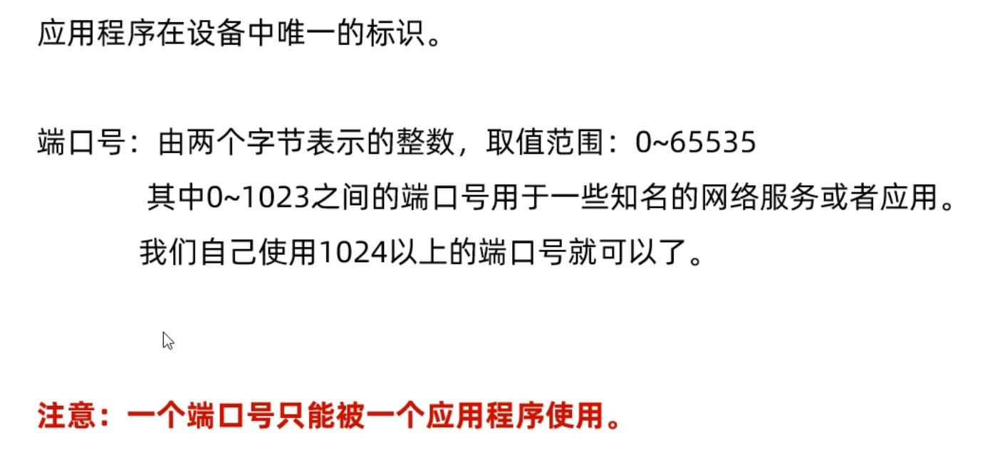
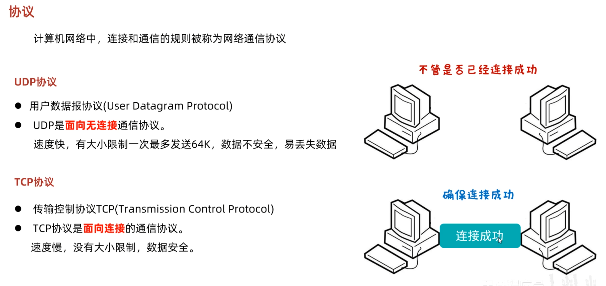
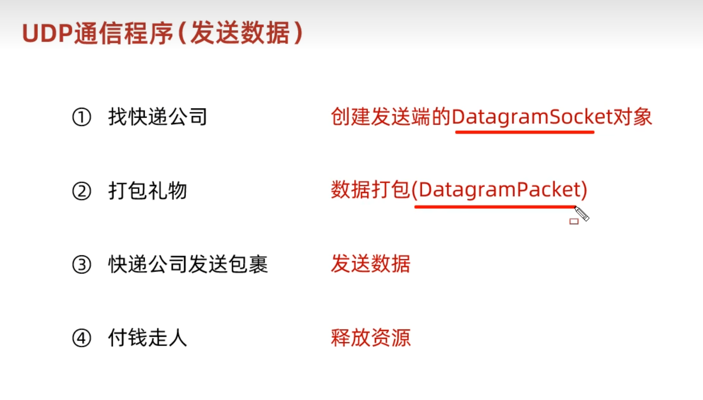
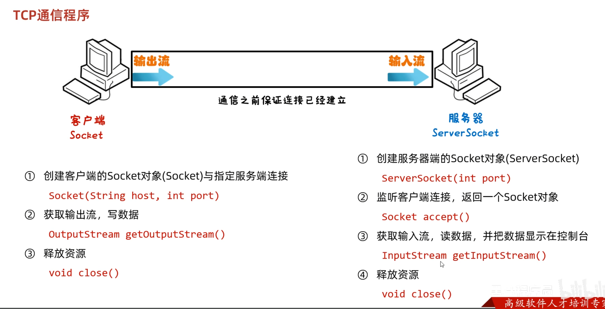
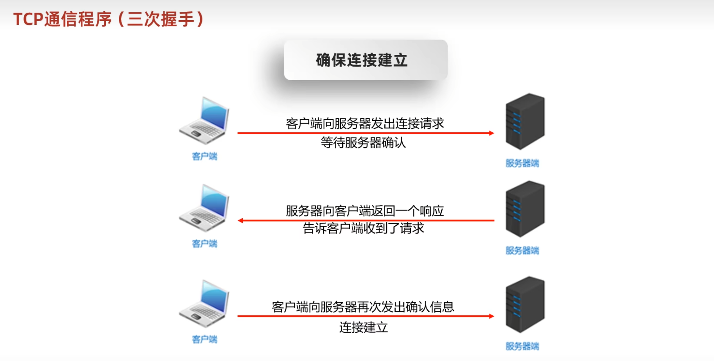
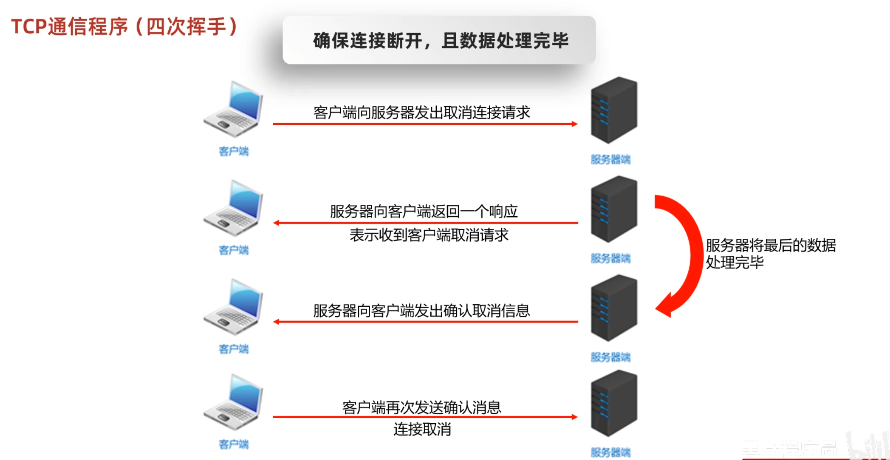
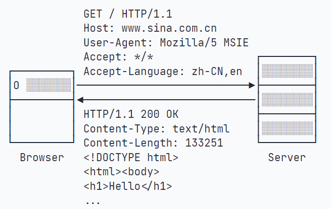

# 网络编程

### 三要素



### IP

- **分为ipv4与ipv6**

ipv4是点分，ipv6是冒分。

ipv4分为公网ip和私有ip，192.168.x.x就是私有ip

```
[ 192.168.1.2 ] \
[ 192.168.1.3 ]  |    => 都通过一个公网 IP 上网
[ 192.168.1.4 ] /         比如：203.0.113.5
```

127.0.0.1就是localhost

### 端口



### 协议



> 注意：UDP端口和TCP端口虽然都使用0~65535，但他们是两套独立的端口，即一个应用程序用TCP占用了端口1234，不影响另一个应用程序用UDP占用端口1234。

### UDP



UDP的三种通信方式

> 单播，组播，广播

### TCP

Transmission Control Protocol



一个Socket就是由IP地址和端口号（范围是0～65535）组成，可以把Socket简单理解为IP地址加端口号。

`accept()` 是阻塞方法，没有客户端连接时，它会一直等待。

- 三次握手

  

- 四次挥手



### HTTP

HTTP是HyperText Transfer Protocol的缩写，翻译为超文本传输协议，它是基于TCP协议之上的一种请求-响应协议。



HTTP请求的格式是固定的，它由HTTP Header和HTTP Body两部分构成。第一行总是`请求方法 路径 HTTP版本`，例如，`GET / HTTP/1.1`表示使用`GET`请求，路径是`/`，版本是`HTTP/1.1`。

后续的每一行都是固定的`Header: Value`格式，我们称为HTTP Header，服务器依靠某些特定的Header来识别客户端请求，例如：

- Host：表示请求的域名，因为一台服务器上可能有多个网站，因此有必要依靠Host来识别请求是发给哪个网站的；
- User-Agent：表示客户端自身标识信息，不同的浏览器有不同的标识，服务器依靠User-Agent判断客户端类型是IE还是Chrome，是Firefox还是一个Python爬虫；
- Accept：表示客户端能处理的HTTP响应格式，`*/*`表示任意格式，`text/*`表示任意文本，`image/png`表示PNG格式的图片；
- Accept-Language：表示客户端接收的语言，多种语言按优先级排序，服务器依靠该字段给用户返回特定语言的网页版本。