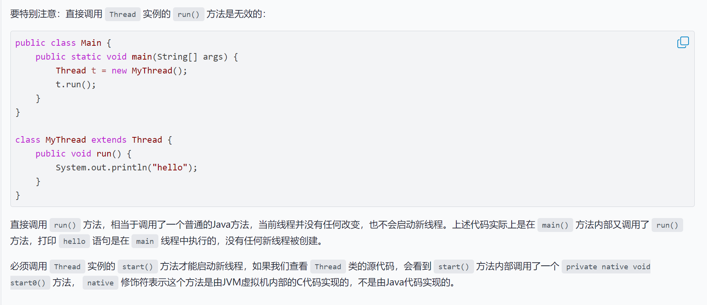
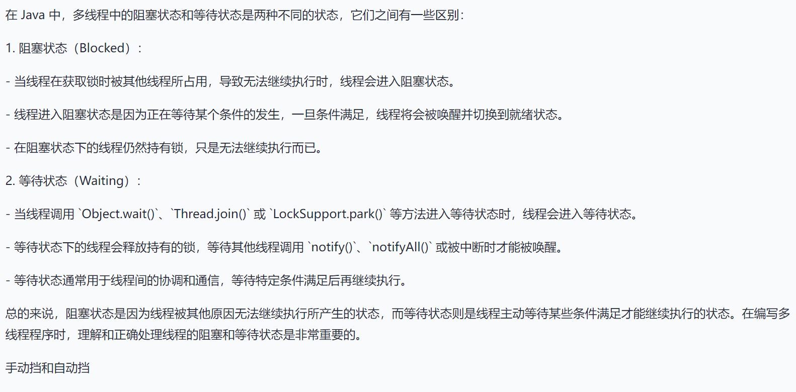
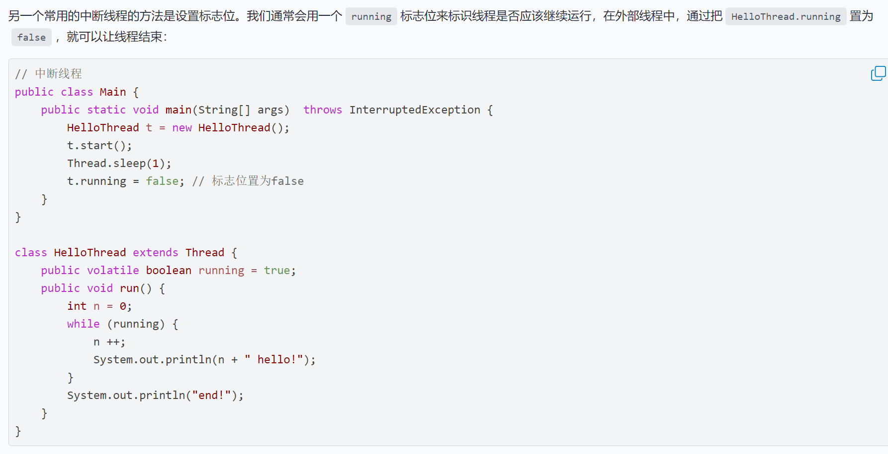

# 进程和线程

**进程包括n个线程**

基本写法：``Thread t=new Thread();``

​				   ``t.start();``

但是这个线程启动后实际上什么也不做就立刻结束了。我们希望新线程能执行指定的代码

一般两种写法

> 继承Thread(Thread是一个类)

```java
class MyThread extends Thread{
    @Override
    public void run(){
        System.out.println("lalala")
    }
}
public class Main{
    public static void main(String[] args) {
        Thread t = new MyThread();
        t.start(); // 启动新线程
    }
}
```

> 使用Runnable(Runnable是一个函数式接口)

```java
//使用lambda表达式
public class Main{
    public static void main(String[] args){
        Thread t=new Thread(()->{
            System.out.println("lalala");
        })
    }
}
```



- ``t.join()``方法的意思是 : 当前线程等待t执行完再执行 "谁调用``join()``，谁等待"



### 中断线程

- 用``interrupt()``方法

``interrupt()``方法只是设立了一个标志位，可以使用``while (! isInterrupted()){}``来处理

也可以根据中断处理机制：**线程处于阻塞状态（如调用 Thread.sleep()、Object.wait() 或 Thread.join()）时，可以通过调用 interrupt 方法使其抛出 InterruptedException，从而中断线程的阻塞状态。**



- volatile 是 Java 的一个关键字，用于修饰变量，保证多线程环境下对该变量的可见性。 具体来说，当一个线程修改了被 volatile 修饰的变量，其他线程能够立即看到最新的值。