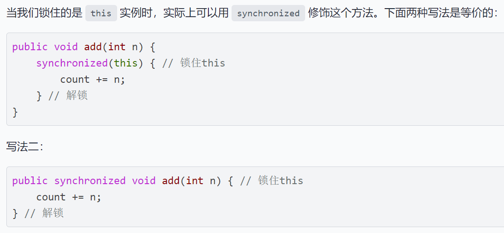
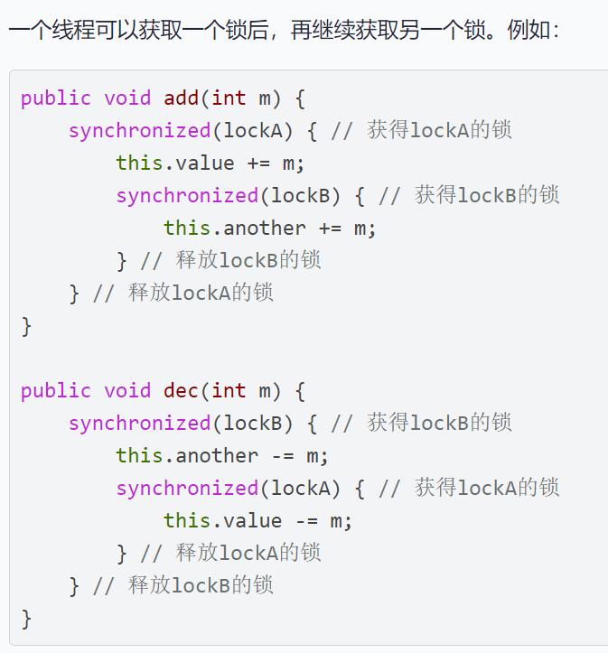
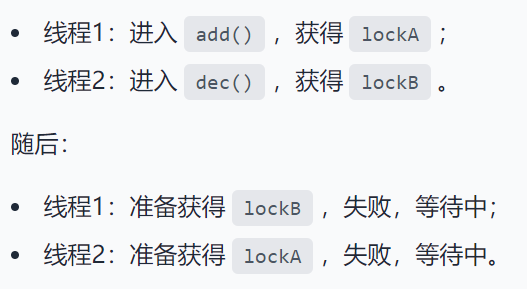
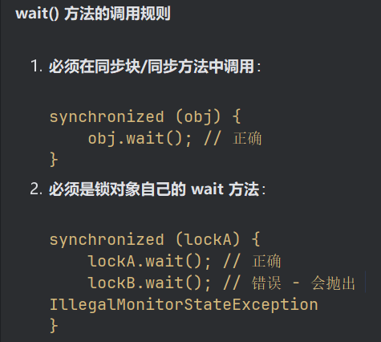
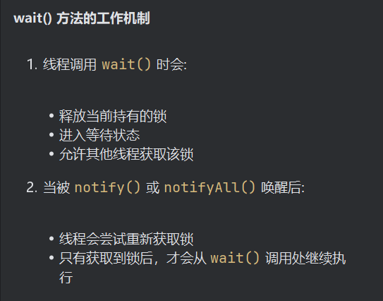

# 进程和线程

**进程包括n个线程**

基本写法：``Thread t=new Thread();``

​				   ``t.start();``

但是这个线程启动后实际上什么也不做就立刻结束了。我们希望新线程能执行指定的代码

- **Runnable更像是“要做的事情”，即任务本身，只定义了run()方法**
- **Thread更像是“执行任务的人”，是线程的载体，负责调度和运行任务**

一般两种写法

> 继承Thread(Thread是一个类)

```java
class MyThread extends Thread{
    @Override
    public void run(){
        System.out.println("lalala")
    }
}
public class Main{
    public static void main(String[] args) {
        Thread t = new MyThread();
        t.start(); // 启动新线程
    }
}
```

> 使用Runnable(Runnable是一个函数式接口)

```java
//使用lambda表达式
public class Main{
    public static void main(String[] args){
        Thread t=new Thread(()->{
            System.out.println("lalala");
        })
    }
}
```


- ``t.join()``方法的意思是 : 当前线程等待t执行完再执行 "谁调用``join()``，谁等待"


### 中断线程

- 用``interrupt()``方法

``interrupt()``方法只是设立了一个标志位，可以使用``while (! isInterrupted()){}``来处理

也可以根据中断处理机制：**线程处于阻塞状态（如调用 Thread.sleep()、Object.wait() 或 Thread.join()）时，可以通过调用 interrupt 方法使其抛出 InterruptedException，从而中断线程的阻塞状态。**


- volatile 是 Java 的一个关键字，用于修饰变量，保证多线程环境下对该变量的可见性。 具体来说，当一个线程修改了被 volatile 修饰的变量，其他线程能够立即看到最新的值。

### 守护线程

创建方法:

```java
Thread t = new MyThread();
t.setDaemon(true);
t.start();
```

在**非守护线程**全部结束时，**JVM**会结束主进程，无论守护进程是启动着还是关闭了

一般作为**后台常驻进程**

### 线程同步

- 原子操作：一个操作要么全部完成，要么完全不做，中间不会被其他线程打断。

也就是说，原子操作是不可分割的最小操作单元，执行过程中不会被线程切换或其他操作干扰，保证数据的一致性和正确性。

由此引出锁`` synchronized ``的概念

一般用Object类创建锁的实例，如`` public static final Object lock = new Object();``

> 这里就是创建了一个lock实例，类型为Object，因为这样轻量，Object是所有类型的父类

- 锁的粒度  

  > 细粒度锁：锁住特定的资源，减 少锁的范围，提高并发性能。
  > 粗粒度锁：锁住较大的范围，简单易用，但可能降低性能。



### 死锁





**死锁发生后，没有任何机制能解除死锁，只能强制结束JVM进程。**

- wait()方法

**wait() 方法必须在已获取锁的线程中调用**





调用`wait()`方法后，线程进入等待状态，`wait()`方法不会返回，直到将来某个时刻，线程从等待状态被其他线程唤醒后，`wait()`方法才会返回，然后，继续执行下一条语句。

- notify()方法

这个方法会唤醒一个正在`this`锁等待的线程

使用`notifyAll()`将唤醒所有当前正在`this`锁等待的线程，而`notify()`只会唤醒其中一个（具体哪个依赖操作系统，有一定的随机性）。

**`java.util.concurrent`包提供了大量更高级的并发功能，能大大简化多线程程序的编写。**

