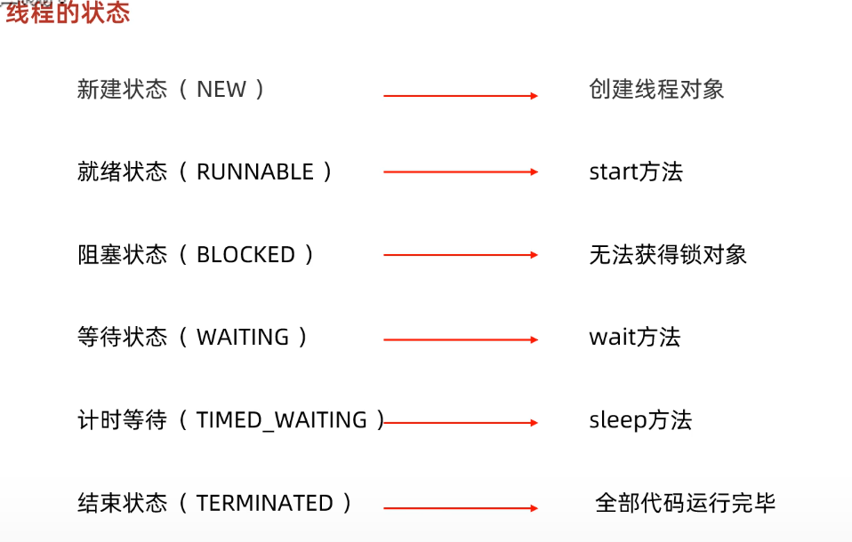

# 进程和线程

**进程包括n个线程**

基本写法：``Thread t=new Thread();``

​				   ``t.start();``

但是这个线程启动后实际上什么也不做就立刻结束了。我们希望新线程能执行指定的代码

- **Runnable更像是“要做的事情”，即任务本身，只定义了run()方法**
- **Thread更像是“执行任务的人”，是线程的载体，负责调度和运行任务**

一般两种写法

> 继承Thread(Thread是一个类)

```java
class MyThread extends Thread{
    @Override
    public void run(){
        System.out.println("lalala")
    }
}
public class Main{
    public static void main(String[] args) {
        Thread t = new MyThread();
        t.start(); // 启动新线程
    }
}
```

> 使用Runnable(Runnable是一个函数式接口)

```java
//使用lambda表达式
public class Main{
    public static void main(String[] args){
        Thread t=new Thread(()->{
            System.out.println("lalala");
        })
    }
}
```


- ``t.join()``方法的意思是 : 当前线程等待t执行完再执行 "谁调用``join()``，谁等待"


### 中断线程

- 用``interrupt()``方法

``interrupt()``方法只是设立了一个标志位，可以使用``while (! isInterrupted()){}``来处理

也可以根据中断处理机制：**线程处于阻塞状态（如调用 Thread.sleep()、Object.wait() 或 Thread.join()）时，可以通过调用 interrupt 方法使其抛出 InterruptedException，从而中断线程的阻塞状态。**


- volatile 是 Java 的一个关键字，用于修饰变量，保证多线程环境下对该变量的可见性。 具体来说，当一个线程修改了被 volatile 修饰的变量，其他线程能够立即看到最新的值。

### 守护线程

创建方法:

```java
Thread t = new MyThread();
t.setDaemon(true);
t.start();
```

在**非守护线程**全部结束时，**JVM**会结束主进程，无论守护进程是启动着还是关闭了

一般作为**后台常驻进程**

### 线程同步

- 原子操作：一个操作要么全部完成，要么完全不做，中间不会被其他线程打断。

也就是说，原子操作是不可分割的最小操作单元，执行过程中不会被线程切换或其他操作干扰，保证数据的一致性和正确性。

由此引出锁`` synchronized ``的概念

一般用Object类创建锁的实例，如`` public static final Object lock = new Object();``

> 这里就是创建了一个lock实例，类型为Object，因为这样轻量，Object是所有类型的父类

- 锁的粒度  

  > 细粒度锁：锁住特定的资源，减 少锁的范围，提高并发性能。
  > 粗粒度锁：锁住较大的范围，简单易用，但可能降低性能。


### 死锁


**死锁发生后，没有任何机制能解除死锁，只能强制结束JVM进程。**

- wait()方法

**wait() 方法必须在已获取锁的线程中调用**


调用`wait()`方法后，线程进入等待状态，`wait()`方法不会返回，直到将来某个时刻，线程从等待状态被其他线程唤醒后，`wait()`方法才会返回，然后，继续执行下一条语句。

- ``notify()``方法(唤醒)

这个方法会唤醒一个正在`this`锁等待的线程

使用`notifyAll()`将唤醒所有当前正在`this`锁等待的线程，而`notify()`只会唤醒其中一个（具体哪个依赖操作系统，有一定的随机性）。

**`java.util.concurrent`包提供了大量更高级的并发功能，能大大简化多线程程序的编写。**

``Lock``是一个接口，``Reetrantlock``是他的一个实现类

```java
public class Counter {
    private final Lock lock = new ReentrantLock();
    private int count;

    public void add(int n) {
        lock.lock();//开始的方法
        try {
            count += n;
        } finally {
            lock.unlock();//结束的方法
        }
    }
}
```

顾名思义，`ReentrantLock`是可重入锁，它和`synchronized`一样，一个线程可以多次获取同一个锁。

和`synchronized`不同的是，`ReentrantLock`可以尝试获取锁：

```java
if (lock.tryLock(1, TimeUnit.SECONDS)) {
    try {
        ...
    } finally {//finally:不管怎样，这段代码一定会被执行
        lock.unlock();
    }
}
```


上述代码在尝试获取锁的时候，最多等待1秒。如果1秒后仍未获取到锁，`tryLock()`返回`false`，程序就可以做一些额外处理，而不是无限等待下去。

所以，使用`ReentrantLock`比直接使用`synchronized`更安全，线程在`tryLock()`失败的时候不会导致死锁。

`wait()` 和 `notify()` 是 **Object类的**方法，**只能与 `synchronized` 一起使用**；而 `ReentrantLock` 是 Java 并发包 `java.util.concurrent.locks` 中的锁机制，它不依赖 `synchronized`，有自己的一套等待/通知机制（`Condition`）。

```java
class TaskQueue {
    private final Lock lock = new ReentrantLock();
    private final Condition condition = lock.newCondition();
    private Queue<String> queue = new LinkedList<>();

    public void addTask(String s) {
        lock.lock();
        try {
            queue.add(s);
            condition.signalAll();
        } finally {
            lock.unlock();
        }
    }

    public String getTask() {
        lock.lock();
        try {
            while (queue.isEmpty()) {
                condition.await();
            }
            return queue.remove();
        } finally {
            lock.unlock();
        }
    }
}

```

可见，使用`Condition`时，引用的`Condition`对象必须从`Lock`实例的`newCondition()`返回，这样才能获得一个绑定了`Lock`实例的`Condition`实例。

`Condition`提供的`await()`、`signal()`、`signalAll()`原理和`synchronized`锁对象的`wait()`、`notify()`、`notifyAll()`是一致的，并且其行为也是一样的：

- `await()`会释放当前锁，进入等待状态；
- `signal()`会唤醒某个等待线程；
- `signalAll()`会唤醒所有等待线程；
- 唤醒线程从`await()`返回后需要重新获得锁。


### ReadWriteLock

- 只允许一个线程写入（其他线程既不能写入也不能读取）；
- 没有写入时，多个线程允许同时读（提高性能）。
- 读锁和写锁互斥

```java
public class Counter {
    private final ReadWriteLock rwlock = new ReentrantReadWriteLock();
    // 注意: 一对读锁和写锁必须从同一个rwlock获取:
    private final Lock rlock = rwlock.readLock();
    private final Lock wlock = rwlock.writeLock();
    private int[] counts = new int[10];

    public void inc(int index) {
        wlock.lock(); // 加写锁
        try {
            counts[index] += 1;
        } finally {
            wlock.unlock(); // 释放写锁
        }
    }

    public int[] get() {
        rlock.lock(); // 加读锁
        try {
            return Arrays.copyOf(counts, counts.length);
        } finally {
            rlock.unlock(); // 释放读锁
        }
    }
}

```

如果我们深入分析`ReadWriteLock`，会发现它有个潜在的问题：如果有线程正在读，写线程需要等待读线程释放锁后才能获取写锁，即读的过程中不允许写，这是一种悲观的读锁。

要进一步提升并发执行效率，Java 8引入了新的读写锁：`StampedLock`。

`StampedLock`和`ReadWriteLock`相比，改进之处在于：读的过程中也允许获取写锁后写入！这样一来，我们读的数据就可能不一致，所以，需要一点额外的代码来判断读的过程中是否有写入，这种读锁是一种乐观锁。

乐观锁的意思就是乐观地估计读的过程中大概率不会有写入，因此被称为乐观锁。反过来，悲观锁则是读的过程中拒绝有写入，也就是写入必须等待。显然乐观锁的并发效率更高，但一旦有小概率的写入导致读取的数据不一致，需要能检测出来，再读一遍就行。

```java
public class Point {
    private final StampedLock stampedLock = new StampedLock();

    private double x;
    private double y;

    public void move(double deltaX, double deltaY) {
        long stamp = stampedLock.writeLock(); // 获取写锁
        try {
            x += deltaX;
            y += deltaY;
        } finally {
            stampedLock.unlockWrite(stamp); // 释放写锁
        }
    }

    public double distanceFromOrigin() {
        long stamp = stampedLock.tryOptimisticRead(); // 获得一个乐观读锁
        // 注意下面两行代码不是原子操作
        // 假设x,y = (100,200)
        double currentX = x;
        // 此处已读取到x=100，但x,y可能被写线程修改为(300,400)
        double currentY = y;
        // 此处已读取到y，如果没有写入，读取是正确的(100,200)
        // 如果有写入，读取是错误的(100,400)
        if (!stampedLock.validate(stamp)) { // 检查乐观读锁后是否有其他写锁发生
            stamp = stampedLock.readLock(); // 获取一个悲观读锁
            try {
                currentX = x;
                currentY = y;
            } finally {
                stampedLock.unlockRead(stamp); // 释放悲观读锁
            }
        }
        return Math.sqrt(currentX * currentX + currentY * currentY);
    }
}

```

和`ReadWriteLock`相比，写入的加锁是完全一样的，不同的是读取。注意到首先我们通过`tryOptimisticRead()`获取一个乐观读锁，并返回版本号。接着进行读取，读取完成后，我们通过`validate()`去验证版本号，如果在读取过程中没有写入，版本号不变，验证成功，我们就可以放心地继续后续操作。如果在读取过程中有写入，版本号会发生变化，验证将失败。在失败的时候，我们再通过获取悲观读锁再次读取。由于写入的概率不高，程序在绝大部分情况下可以通过乐观读锁获取数据，极少数情况下使用悲观读锁获取数据。

可见，`StampedLock`把读锁细分为乐观读和悲观读，能进一步提升并发效率。但这也是有代价的：一是代码更加复杂，二是`StampedLock`是不可重入锁，不能在一个线程中反复获取同一个锁。

`StampedLock`还提供了更复杂的将悲观读锁升级为写锁的功能，它主要使用在if-then-update的场景：即先读，如果读的数据满足条件，就返回，如果读的数据不满足条件，再尝试写。

> `StampedLock` 内部维护了一个**版本号（或称“状态戳”）**，每当：
>
> - 写锁加锁或释放时（数据可能被修改）→ 版本号会**变化**
> - 乐观读 `tryOptimisticRead()` 返回的是**当前版本号**

### Semaphore

> 限制线程数量

```
public class AccessLimitControl {
    // 任意时刻仅允许最多3个线程获取许可:
    final Semaphore semaphore = new Semaphore(3);

    public String access() throws Exception {
        // 如果超过了许可数量,其他线程将在此等待:
        semaphore.acquire();
        try {
            // TODO:
            return UUID.randomUUID().toString();
        } finally {
            semaphore.release();
        }
    }
}

```

使用`Semaphore`先调用`acquire()`获取，然后通过`try ... finally`保证在`finally`中释放。

调用`acquire()`可能会进入等待，直到满足条件为止。也可以使用`tryAcquire()`指定等待时间：

```java
if (semaphore.tryAcquire(3, TimeUnit.SECONDS)) {
    // 指定等待时间3秒内获取到许可:
    try {
        // TODO:
    } finally {
        semaphore.release();
    }
}

```

`Semaphore`本质上就是一个信号计数器，用于限制同一时间的最大访问数量。

> 阻塞队列


``` java
import java.util.concurrent.ArrayBlockingQueue;

public class Main {
    public static void main(String[] args) {
        ArrayBlockingQueue<String> queue= new ArrayBlockingQueue<>(1);
        Thread t1=new Cook(queue);
        Thread t2=new Consumer(queue);
        t1.start();
        t2.start();
    }
}
class Consumer extends Thread{
    ArrayBlockingQueue<String> queue;
    public Consumer(ArrayBlockingQueue<String> queue){
        this.queue=queue;
    }
    @Override
    public void run() {
        while (true){
            try {
                String food = queue.take();
            } catch (InterruptedException e) {
                throw new RuntimeException(e);
            }
        }
    }
}
class Cook extends Thread{
    ArrayBlockingQueue<String> queue;
    public Cook(ArrayBlockingQueue<String> queue){
        this.queue=queue;
    }
    @Override
    public void run() {
        while (true){
            try {
                queue.put("面条");
            } catch (InterruptedException e) {
                throw new RuntimeException(e);
            }
        }


    }
}
```

> put和take方法内部都自带了锁



## 线程池

```java
// 创建固定大小的线程池:
ExecutorService executor = Executors.newFixedThreadPool(3);
// 提交任务:
executor.submit(task1);
executor.submit(task2);
executor.submit(task3);
executor.submit(task4);
executor.submit(task5);
```

`ExecutorService`只是接口，Java标准库提供的几个常用实现类有：

- FixedThreadPool：线程数固定的线程池；
- CachedThreadPool：线程数根据任务动态调整的线程池；
- SingleThreadExecutor：仅单线程执行的线程池。

创建这些线程池的方法都被封装到`Executors`这个类中。我们以`FixedThreadPool`为例，看看线程池的执行逻辑：

```java
// thread-pool
import java.util.concurrent.*;

public class Main {
    public static void main(String[] args) {
        // 创建一个固定大小的线程池:
        ExecutorService es = Executors.newFixedThreadPool(4);
        for (int i = 0; i < 6; i++) {
            es.submit(new Task("" + i));
        }
        // 关闭线程池:
        es.shutdown();
    }
}

class Task implements Runnable {
    private final String name;

    public Task(String name) {
        this.name = name;
    }

    @Override
    public void run() {
        System.out.println("start task " + name);
        try {
            Thread.sleep(1000);
        } catch (InterruptedException e) {
        }
        System.out.println("end task " + name);
    }
}
```

### Future

`Runnable`接口有个问题，它的方法没有返回值。如果任务需要一个返回结果，那么只能保存到变量，还要提供额外的方法读取，非常不便。所以，Java标准库还提供了一个`Callable`接口，和`Runnable`接口比，它多了一个返回值：

```java
class Task implements Callable<String> {
    public String call() throws Exception {
        return longTimeCalculation(); 
    }
}
//如果仔细看ExecutorService.submit()方法，可以看到，它返回了一个Future类型，一个Future类型的实例代表一个未来能获取结果的对
ExecutorService executor = Executors.newFixedThreadPool(4); 
// 定义任务:
Callable<String> task = new Task();
// 提交任务并获得Future:
Future<String> future = executor.submit(task);
// 从Future获取异步执行返回的结果:
String result = future.get(); // 可能阻塞
```

当我们提交一个`Callable`任务后，我们会同时获得一个`Future`对象，然后，我们在主线程某个时刻调用`Future`对象的`get()`方法，就可以获得异步执行的结果。在调用`get()`时，如果异步任务已经完成，我们就直接获得结果。如果异步任务还没有完成，那么`get()`会阻塞，直到任务完成后才返回结果。
